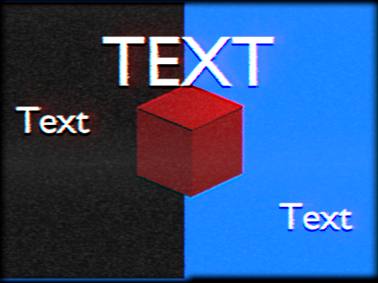

blender-vhs-filter
==================

A VHS tape noise filter node for Blender. Note this filter adds noise, not reduce noise.

This is a blend file containing 3 compositing group nodes:

``comp_vhs_1``
    A 1 input, 1 output node that adds noise, blurs, shakes, bleeds the image.

``comp_vhs_1_no_noise``
    Same thing as ``comp_vhs_1`` but without noise.

``comp_vhs_1_4-3_crop``
    A 1 input, 1 output node that crops the image simulating an overscan area.

To use the nodes:

1. Select Link or Append
2. Select the blend file.
3. Select TreeNode.
4. Select VHS filter nodes.
5. In the compositor, select Add, Group, and then the nodes.

